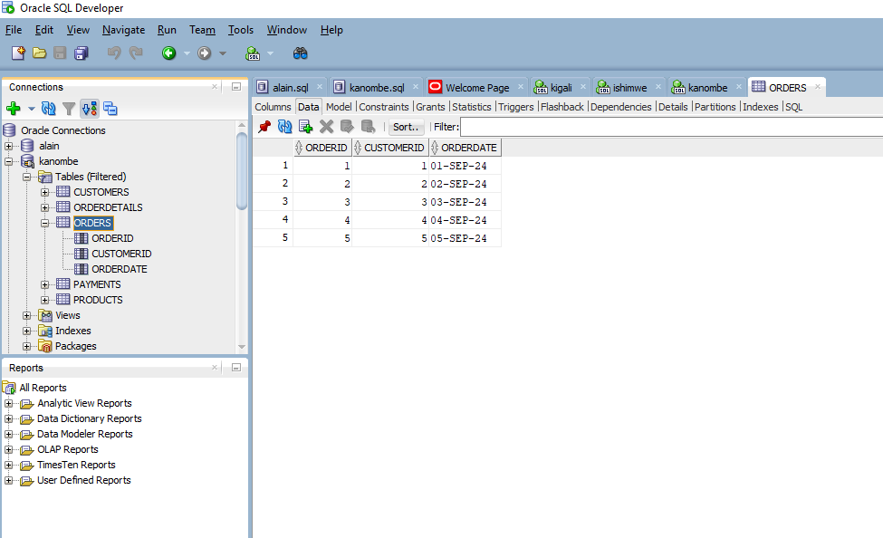
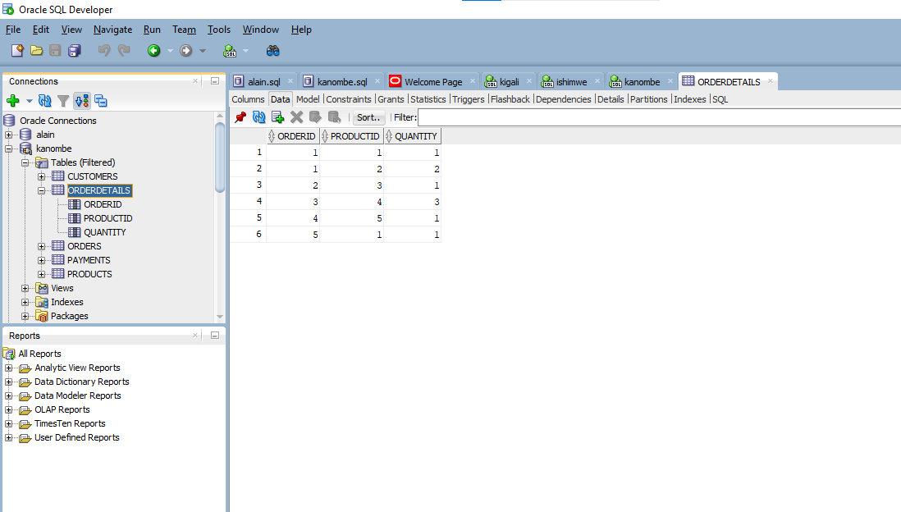
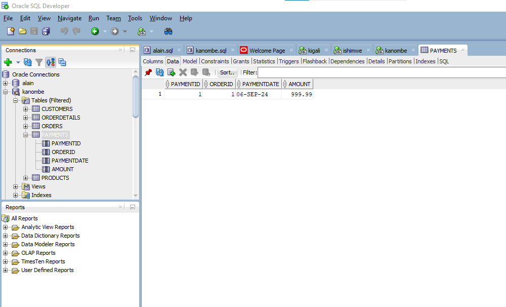
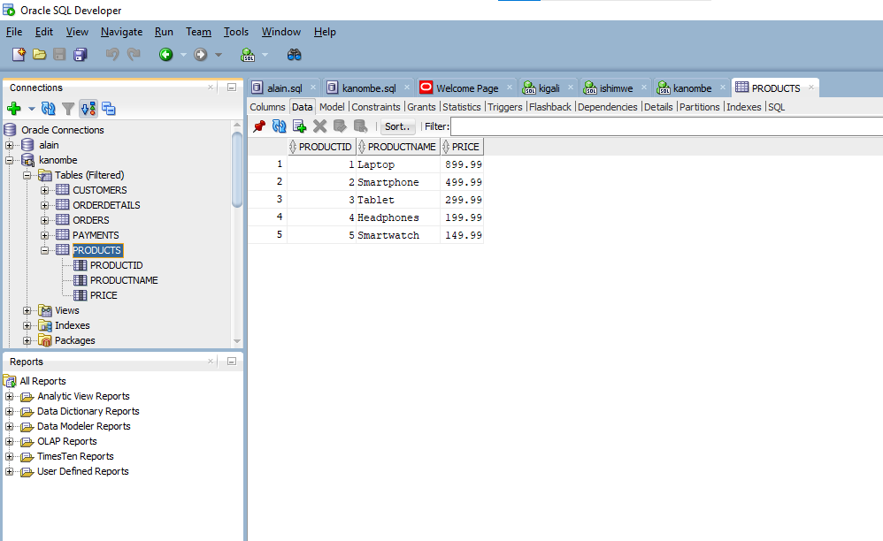
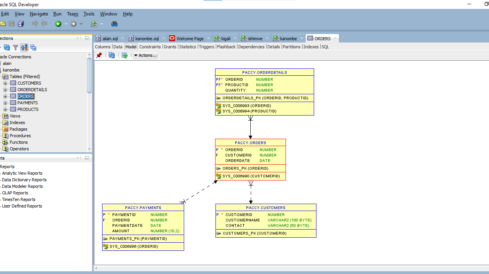

# PROBLEM STATEMENT
# Overview 

This database management system is designed to handle customer orders, products, and order details. It consists of four primary tables: Customers, Orders, Products, and OrderDetails. The database supports operations such as creating, reading, updating, and deleting data, as well as performing joins and subqueries to retrieve related information.
# Table structures
# Custmer table
CREATE TABLE Customers (
    CustomerID NUMBER PRIMARY KEY,
    CustomerName VARCHAR2(100),
    Contact VARCHAR2(50)
    );
# Image about Customer table contents

# Image about Order

# image about Order detail

# image about payment

# Image about Product 

# Image about Customer table contents

