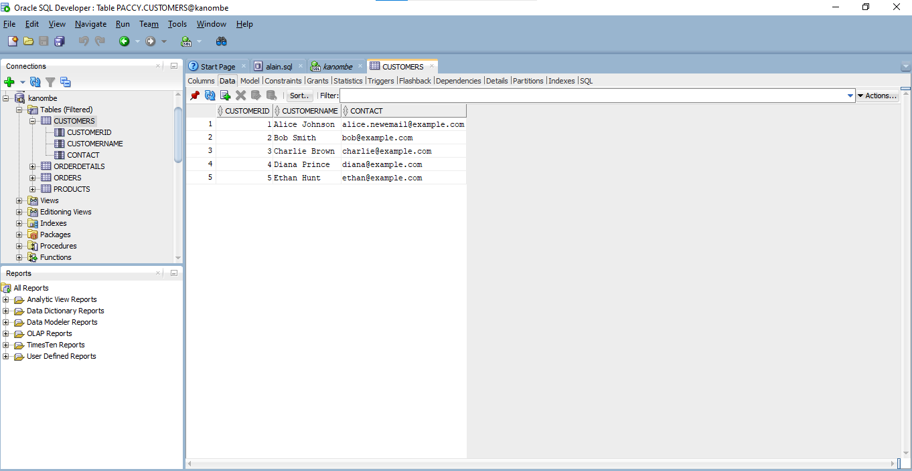

<!DOCTYPE html>
<html lang="en">
<head>
    <meta charset="UTF-8">
    <meta name="viewport" content="width=device-width, initial-scale=1.0">
    <title>Image Gallery</title>
    
</head>
<body>

<h2>Image Gallery</h2>

    

        
        
Image Description 1

    

    

        
        
Image Description 2

    

    

        
        
Image Description 3

    

    

        
        
Image Description 4

    

    

        
        
Image Description 5

    

    

        
        
Image Description 6

    

</body>
</html>
